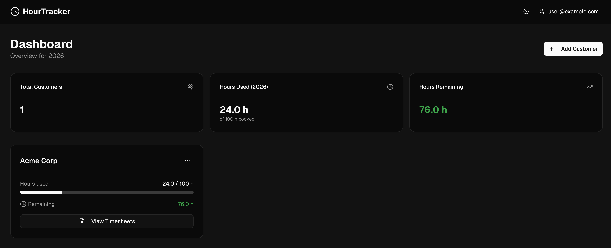

# Hour Tracker



A self-hosted time tracking web application for freelancers to manage customers, timesheets, and log hours. Export timesheets as PDF for invoicing.

> This is a personal project without formal security audits. It is designed for local or trusted-network use. See the [Security](#security) section before exposing it to the internet.

## Features

- Customer management (create, edit, delete)
- Monthly timesheets per customer
- Time entry logging with descriptions
- PDF export for invoicing
- Dark mode support
- Fully self-hosted with Docker

## Tech Stack

- **Frontend:** Next.js (App Router), React, TypeScript, Tailwind CSS, shadcn/ui
- **Backend:** Supabase (PostgreSQL, PostgREST, GoTrue Auth)
- **Infrastructure:** Docker Compose, Kong API Gateway
- **Optional:** S3 backup/restore for database durability

## Quick Start

```bash
# Clone the repo
git clone https://github.com/flo-kn/hourtracker.git
cd hourtracker

# Generate unique secrets (.env + Kong config)
./scripts/generate-env.sh

# Start all services
docker-compose up -d

# Create a test user
./seed-user.sh
```

> Skipping `generate-env.sh` still works — Docker Compose falls back to built-in demo
> defaults — but the secrets will be publicly known. Fine for a quick local test, not
> for anything exposed to a network.

Then open http://localhost:3001 and log in with:
- **Email:** `user@example.com`
- **Password:** `testpassword123`

See [DOCKER_README.md](./DOCKER_README.md) for full Docker setup details, database access, backup/restore, and troubleshooting.

## Development

### Prerequisites

- Docker and Docker Compose
- Node.js 18+ and pnpm (for local dev without Docker)

### Local Development (without Docker for the app)

The Next.js app can run outside Docker, but it still needs a Supabase backend. Either start the Supabase services via Docker or use a hosted [Supabase](https://supabase.com) project.

```bash
# Start only the Supabase services (DB, Auth, API gateway, etc.)
docker-compose up -d db kong rest auth inbucket meta

# In a separate terminal, run the Next.js app locally
pnpm install
cp .env.example .env.local
# Edit .env.local with your Supabase URL and anon key
pnpm dev
```

If using the local Docker services, the defaults in `.env.example` already point to `http://localhost:8001`. Replace the anon key placeholder with the key from [DOCKER_README.md](./DOCKER_README.md#api-configuration).

### Running Tests

```bash
pnpm test
```

## Security

Running `./scripts/generate-env.sh` before first start gives you unique Postgres
passwords, JWT secrets, and API keys. Internal services (Postgres, PostgREST,
GoTrue, Kong admin, etc.) are bound to `127.0.0.1` so they are only reachable from
the host machine, not from the wider network.

Before deploying to production, also review:

- Enable HTTPS/TLS for all endpoints
- Disable `GOTRUE_MAILER_AUTOCONFIRM` and configure real SMTP
- Restrict CORS and configure rate limiting
- Use a production-grade PostgreSQL instance

See [DOCKER_README.md](./DOCKER_README.md#production-deployment) for production deployment guidance.

## Contributing

Contributions are welcome! Please open an issue or submit a pull request.

## License

This project is licensed under the [MIT License](./LICENSE).

## TODOs

- [ ] Quick Launch Feature as replacement for terminal `docker compose up`